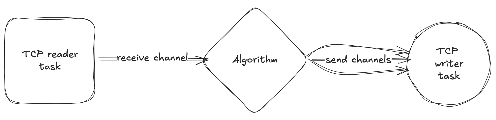
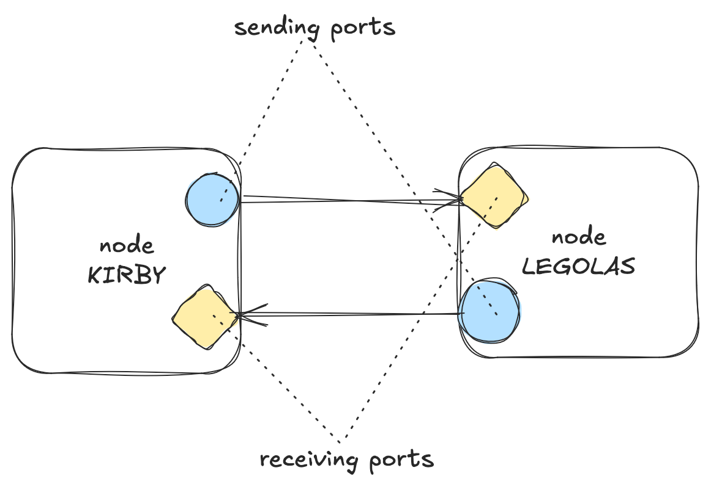

# Atomic Register

This repo contains multiple implementations of various distributed algorithms for a replicated atomic register abstraction (or in layman's terms, a distributed key-value store).

The atomic register abstraction has 2 operations:
1. `READ(key)` which returns the value of the `key`.
2. `WRITE(key, value)` which sets the `key` to the `value`.

Unlike most commercial key-value stores, an important distinction of this project is that it is implementing [linearizable algorithms](https://jepsen.io/consistency/models/linearizable) (usually referred as Strong Consistency).

## Algorithms

- [x] [ABD](https://dl.acm.org/doi/pdf/10.1145/200836.200869)
- [x] [Paxos](https://lamport.azurewebsites.net/pubs/paxos-simple.pdf)
- [ ] [Fast Paxos](https://www.microsoft.com/en-us/research/wp-content/uploads/2016/02/tr-2005-112.pdf)
- [ ] [Raft](https://raft.github.io/)

## Boiler-plate implementation

The idea is very simple, abstract away the network layer (in this case TCP) completely behind channels. The algorithms will just take receive channels to receive messages and a "virtual" network of channels to send messages to appropriate nodes. This way, I can quickly implement different algorithms and test them on exactly the same network code. Another benefit of this is that the algorithms become easily testable, as now I can just emulate the network through the channels.



The network is fully symmetric with each node connected to other nodes with 2 half-duplex TCP connections. Basically, each node has a port used to receive the messages and a port from which it sends messages. This is because it is not possible to bind 2 TCP sockets to the same port at the same time (so either a node can receive messages on the port, or connect to another node from a port). As a result, it is a lot more complex to build such a system using full-duplex connections, as the network isn't symmetrical, but some nodes must listen and some must connect. Consequently, there has to be some kind of ordering for initialization, which further complicates code.



## How to start the program

You have to specify two positional command line arguments in order for a node to start - `node_id` and `path_to_config_file`. An example command to start a node would be `atomic_register 1 config.toml`.

The config file is a `.toml` file which contains the mapping of `NodeId`s to the corresponding nodes source and destination ip addresses - you can take a look at the `config.toml` file in the repo for an example.

## Adding network delay

### MacOS
1. Make sure that `pf` is running: `sudo pfctl -E`
2. In the `/etc/pf.conf` file add a dummynet anchor:
    ```
    dummynet-anchor ts
    anchor ts
    ```
3. Reload the pf config: `sudo pfctl -f /etc/pf.conf` - check loaded rules with: `sudo pfctl -s rules` to see the anchor.
4. Make `dnctl` rules: `sudo dnctl pipe 1 config delay 100` - adds 100ms
5. Make a network config file - see [pf.conf](https://man.freebsd.org/cgi/man.cgi?pf.conf(5)#PARAMETERS) for possible parameters, example:
    ```
   dummynet out from 127.0.0.1 to 127.0.0.1 pipe 1
   ```
   Sends any packet from `127.0.0.1` to `127.0.0.1` to pipe 1
6. Load the rules: `sudo pfctl -a ts -f <config file>`

To reset the rules:
1. Run `sudo pfctl -a ts -F all` - flushes all rules in anchor `ts`
2. `sudo dnctl -q flush` - flushes rules for dummynet pipes (`-q` for quiet).

### Delay configuration

The `run.py` script will try to parse `delays.toml` file to read the propagation
time for different links between the nodes. An exmaple of a delay config:

```toml
1 = { 2 = 80, 3 = 150, 4 = 250, 5 = 100 }
2 = { 1 = 80, 3 = 70, 4 = 170, 5 = 180 }
3 = { 1 = 150, 2 = 70, 4 = 100, 5 = 250 }
4 = { 1 = 250, 2 = 170, 3 = 100, 5 = 150 }
5 = { 1 = 100, 2 = 180, 3 = 250, 4 = 150 }
```

This means that the link from node `1` to node `2` needs `80ms` to propagate the message.
If a node is omitted, it's propagation delay is treated as `0ms`. Additionally, asymmetric
links are supported, for example:

```toml
1 = { 2 = 80 }
2 = { 1 = 90 }
```

A message from node `1` to node `2` will take `80ms` to arrive, while a message from
node `2` to node `1` will take `90ms` to arrive.


### Network Problems

In times of concurrent operations, the algorithm is taking 4RTs to complete.
This occurs because the Nagel's algorithm was enabled. 
Because the packets are very small, Nagel's algorithm would wait until ACK arrives before sending the next message.
